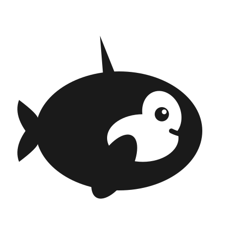

# ORCA DAM - ORCA Retrieves Cloud Assets



A Digital Asset Management system for AWS S3 with AI-powered tagging.

## Documentation map

Each document owns one subject. If you find the same thing written in two places, the
copy that is **not** listed below is the one to delete.

| Document | Owns | For |
|---|---|---|
| **README.md** (this file) | What ORCA is, the feature list, a quickstart, and pointers | First-time visitor |
| [SETUP_GUIDE.md](SETUP_GUIDE.md) | Full install + configuration, AWS IAM policy, PHP limits, customization, app-level troubleshooting | Standing it up |
| [DEPLOYMENT.md](DEPLOYMENT.md) | Production ops: server requirements, Supervisor, Nginx/Apache, SSL, backup, server-level troubleshooting | Deploying |
| [RTE_INTEGRATION.md](RTE_INTEGRATION.md) | The complete REST API + auth reference, and editor/CMS integrations | Integrating |
| [QUICK_REFERENCE.md](QUICK_REFERENCE.md) | Dev cheat sheet: commands, routes, repo layout | Contributing daily |
| [USER_MANUAL.md](USER_MANUAL.md) · [GEBRUIKERSHANDLEIDING.md](GEBRUIKERSHANDLEIDING.md) | How to *use* ORCA, EN + NL | End users |
| [CLAUDE.md](CLAUDE.md) + [specs/](specs/README.md) | Conventions, and the authoritative behavioural contract | Contributors & agents |
| [CONTRIBUTING.md](CONTRIBUTING.md) | Workflow and the spec-before-code gate | Contributors |
| [CHANGELOG.md](CHANGELOG.md) | Release history | Everyone |

`specs/` is the source of truth for behaviour: 47 feature specs, 16 ADRs, and recipes.
Prose docs describe *usage*; specs define *behaviour*. When they disagree, the spec wins.

## Features

- 🧭 **Guided demos** — interactive onboarding that spotlights real controls on the real page, spans the dashboard, library and upload screen, and never starts on its own
- 🔐 Multi-user support (Editors & Admins)
- 📁 Direct S3 bucket integration
- 🏷️ Manual, AI-powered (AWS Rekognition), and reference tagging
- 🌍 Multilingual AI tags via AWS Translate (en, nl, fr, de, es, etc.)
- 🎯 Manual AI tag generation with configurable limits
- ✏️ **Editable filenames** (display name only — S3 key and URLs stay the same)
- 🌐 **Multi-language UI** (English, Dutch) with global and per-user locale
- 🔗 **Custom domain for asset URLs** (e.g., `https://cdn.example.com` instead of S3 bucket URL)
- ⚙️ Admin Settings panel (pagination, AI tag settings, language, custom domain)
- 🔍 Advanced search with operators (`+require`, `-exclude`)
- 🖼️ Thumbnail generation, grid, masonry & list views
- 🏷️ Bulk tag management (add/remove tags on multiple assets, bulk delete tags)
- 📤 Multi-file upload with drag & drop
- 🚀 **Chunked upload for large files (up to 500MB)**
- ⚡ Automatic upload method selection (direct <10MB, chunked ≥10MB)
- 🔄 Smart retry logic with exponential backoff
- 📝 License type and copyright metadata
- ♿ Accessibility support (alt text, captions)
- 📊 CSV export with separate user/AI/reference tag columns
- 📥 Bulk metadata import from CSV (paste or upload)
- 🔗 Easy URL copying for external integration
- 🔎 Discover unmapped S3 objects
- 🛡️ **Duplicate prevention** with actionable results panel — etag-based detection, per-row status pills, and an inline Duplicates panel showing thumbnails, "View existing", "Copy URL", multi-select bulk-copy, "Reveal in library", and one-click restore for trashed duplicates
- 📎 **Keep original filename** option during upload
- 🏷️ **Tag attribution** — shows who last assigned a tag (User or AI)
- 🗑️ Trash & restore system with soft delete (keeps S3 objects)
- ♻️ Restore for editors and admins; permanent delete for admins only
- 📦 Bulk move assets between S3 folders (maintenance mode)
- 🗑️ Bulk permanent delete from index page (maintenance mode)
- 🗑️ Bulk move to trash from index page (editors + admins)
- 📥 Bulk download as ZIP (max 100 files / 500MB)
- ✔️ S3 integrity verification (detect missing assets in cloud storage)
- 📱 Responsive design
- 🖼️ **Embeddable asset browser** (`/assets/embed`) for iframe integration, with configurable allowed domains
- 🌐 OpenAPI 3 for Rich Text Editor or System integration
- 🟦 **WordPress plugin** (`wordpress-plugin/`) — Gutenberg media-library tab to pick ORCA assets directly from WordPress posts; auto-tags assets with reference tags like `wp:site.com/post/N`; auto-updates from GitHub Releases. See `wordpress-plugin/README.md`.
- 🔓 Public metadata API endpoint (no auth required)
- 🔒 Long-lived token support (Laravel Sanctum Token) for back-ends
- 🔑 Short-lived token support (JWT bearer) for front-ends
- 👤 User preferences (home folder, items per page, language, dark/light mode)
- 🔒 Two-factor authentication (TOTP)
- 🔑 **Passkeys** (WebAuthn / FIDO2) — passwordless sign-in with Touch ID, Face ID, Windows Hello, or hardware keys; bypasses TOTP on successful passkey login
- 🖊️ **TikZ Server Render** — compile TikZ/LaTeX diagrams server-side via TeX Live, with SVG and PNG output variants, 17 font packages, template management, and direct upload to ORCA (renders are linked back to their source `.tex` template via asset parent/child relations)
- ☁️ **Cloudflare cache purge** — automatically purges CDN cache when an asset file is replaced (requires custom domain + toggle in Settings)
- 🐳 **Hidden easter egg** — double-click the ORCA logo to launch a little game; high scores are kept on a per-user leaderboard

## Installation

**Quickstart** (development, assumes PHP, Composer, Node and an S3 bucket are ready):

```bash
git clone <your-repo> && cd orca-dam
composer install && npm install
cp .env.example .env && php artisan key:generate   # then fill in AWS_* — see .env.example
php artisan migrate && php artisan db:seed --class=AdminUserSeeder
npm run dev && php artisan serve
```

### Prerequisites
- PHP 8.3+ (`composer.json` requires `^8.3`; 8.4 recommended) with `memory_limit` ≥ 256M
- Composer, Node.js & NPM
- MariaDB (see [ADR-008](specs/decisions/adr-008-sqlite-tests.md)); SQLite works for small deployments
- An AWS account with an S3 bucket
- GD or Imagick for image processing
- Supervisor on the production server

**Everything else lives in [SETUP_GUIDE.md](SETUP_GUIDE.md)**: the annotated `.env`
(AWS, Rekognition, TikZ, Cloudflare, JWT), the AWS IAM policy, the PHP upload limits for
chunked vs. direct mode, and troubleshooting. `.env.example` is the authoritative list of
environment variables. For production, go to [DEPLOYMENT.md](DEPLOYMENT.md) instead.

## Usage

Day-to-day usage — uploading, browsing, tagging, trash, bulk actions, discover, import,
export, the admin panels — is documented for end users in
[USER_MANUAL.md](USER_MANUAL.md) (Dutch: [GEBRUIKERSHANDLEIDING.md](GEBRUIKERSHANDLEIDING.md)).

### User roles

Three roles: `admin`, `editor`, `api`. Editors upload, edit, tag, and soft-delete;
admins additionally get permanent delete, user management, discover, import/export, bulk
move, and the system panels; the `api` role is read/write for integrations but cannot
delete. The authoritative matrix — every ability against every role, pinned by
`tests/Unit/Policies/AssetPolicyTest.php` — is
[specs/features/authorization-policies.md](specs/features/authorization-policies.md),
summarised in [CLAUDE.md](CLAUDE.md#authorization-apppolicies). A role-by-role walkthrough
for end users is in [USER_MANUAL.md](USER_MANUAL.md#your-role-editor-vs-admin).

### REST API

The full endpoint reference — assets, tags, folders, reference tags, chunked upload,
Sanctum vs. JWT authentication, query parameters, and editor integrations — is
[RTE_INTEGRATION.md](RTE_INTEGRATION.md). Behaviour is specified in
[specs/features/rest-api.md](specs/features/rest-api.md),
[reference-tags-api.md](specs/features/reference-tags-api.md) and
[chunked-upload.md](specs/features/chunked-upload.md).

`/api/assets/meta` and `/api/health` are public; everything else needs a token. Upload
endpoints can be switched off at runtime via **API Docs → Dashboard → Upload Endpoints**.

## Testing

```bash
php artisan config:clear && php artisan test    # 1127 tests, in-memory SQLite
php artisan test --testsuite=Security          # security invariants + exploit probes only
npm run test:e2e                               # 131 Playwright tests against a real stack
./vendor/bin/phpstan analyse                    # static analysis (Larastan, level 2, no baseline)
npm run spec:lint                              # spec structure + documented facts
```

Semgrep runs the custom rules in `.semgrep/orca.yml` as its own CI job. It needs Python, so it is
not a required local dependency — see [CONTRIBUTING.md](CONTRIBUTING.md) if you want it locally.

Always `config:clear` first: a stale `bootstrap/cache/config.php` can point
`RefreshDatabase` at the development database. Admins can also run the Pest suite from
the browser via **System → Tests**. Full command set and the E2E prerequisites (MinIO,
Chromium) are in [QUICK_REFERENCE.md](QUICK_REFERENCE.md) and
[specs/features/e2e-testing.md](specs/features/e2e-testing.md).

## Architecture

- **Backend:** Laravel 13 with AWS SDK v3
- **Frontend:** Blade templates + Alpine.js (22 modules registered in `resources/js/app.js`)
- **Styling:** Tailwind CSS with custom ORCA theme
- **Image Processing:** Intervention Image 4.x (GD driver)
- **AI Tagging:** AWS Rekognition (with job queue for background processing)
- **Translation:** AWS Translate (for multilingual AI tags)
- **Storage:** AWS S3 (public-read bucket via bucket policy)
- **Queue:** Database driver for background jobs (AI tagging, integrity checks, image resizing)

## Repository layout

The annotated file tree lives in [QUICK_REFERENCE.md](QUICK_REFERENCE.md#file-locations) —
one copy, checked by `npm run spec:lint`. For how the pieces fit together (service map,
request lifecycle, middleware stack, queue/job map, S3 topology, data model), read
[specs/architecture.md](specs/architecture.md).

## WordPress Plugin

A companion WordPress plugin (`wordpress-plugin/`) adds an **ORCA DAM** tab to the WordPress media-library modal, so editors can pick assets from ORCA without copy-pasting URLs. Selections insert as `` tags pointing at the ORCA CDN URL, and on save the plugin POSTs to `/api/reference-tags` so ORCA tracks which post on which site uses each asset (e.g. `wp:site.com/post/12`).

- Auth: Sanctum token (long-lived), stored encrypted in `wp_options`
- Distribution: `.zip` attached to GitHub Releases tagged `wp-v*`; auto-update via plugin-update-checker
- Local dev: `npx wp-env start` (uses mock ORCA by default)
- Full setup, release, and install guide: [`wordpress-plugin/README.md`](wordpress-plugin/README.md)

## License

MIT License

## Credits

Copyright © 2026 Gijs Oliemans & Studyflow.
Built together with Claude, as part of an AI pilot for Studyflow.
